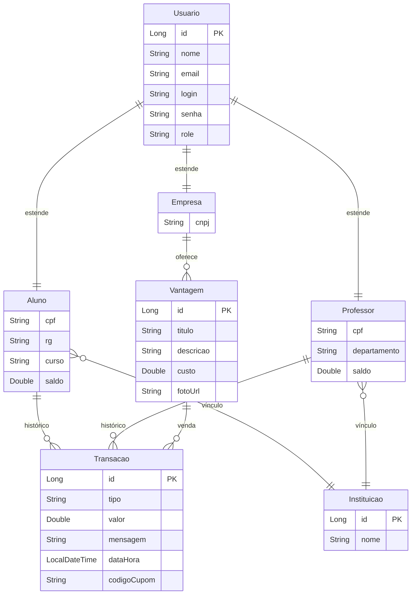

# PUCPay - Sistema de Moeda Estudantil

O **PUCPay** é uma plataforma de mérito estudantil que utiliza gamificação para estimular o engajamento escolar. Através de uma economia virtual baseada em **PUCCoins**, professores podem recompensar alunos por desempenho e participação, enquanto empresas parceiras oferecem um catálogo de vantagens reais para troca.

---

## 🏗️ Arquitetura do Sistema

O projeto foi construído seguindo os princípios de **Clean Code** e **Responsabilidade Única**, utilizando uma separação clara entre a interface do usuário e o servidor de processamento.

### 🏛️ Backend (Java Spring Boot)
O backend é uma API RESTful robusta que segue o padrão de **Camadas**:

1.  **Entidades (Model)**: Utiliza a estratégia `JOINED` de herança do Hibernate, permitindo uma base comum de `Usuário` com tabelas específicas para `Aluno`, `Professor`, `Empresa` e `Admin`.
2.  **DAO (Data Access Object)**: Implementação de acesso a dados isolada, permitindo flexibilidade e facilidade de testes, fugindo do acoplamento direto com o Spring Data JPA em alguns pontos críticos.
3.  **Serviços (Service)**: Camada onde reside a inteligência do sistema, como o processamento de transações, validação de saldos e regras de resgate.
4.  **Controladores (REST)**: Endpoints documentados que expõem os recursos do sistema.

### 🎨 Frontend (React + Vite)
Uma Single Page Application (SPA) moderna focada em performance e UX:

-   **Context API**: Gerenciamento de estado global para persistência de sessão e dados do perfil.
-   **Hook Pattern**: Uso de hooks customizados para abstrair lógica de componentes.
-   **Roteamento**: React Router 7 para navegação fluida e protegida por níveis de acesso.
-   **Componentização**: Componentes agnósticos e reutilizáveis, garantindo consistência visual.

---
## ✨ Interface Premium (Apple-inspired UX)

Recentemente, o PUCPay passou por um **total overhaul visual**, elevando a experiência do usuário para um padrão de mercado premium:

-   **Glassmorphism**: Uso extensivo de transparências, desfoque de fundo e bordas sutis para um visual limpo e moderno.
*   **Animações Fluídas**: Implementação de `motion/react` para transições de página, feedback de hover e micro-interações que tornam a interface viva.
-   **Dashboard Data-Driven**: Visualização de saldos e extratos através de gráficos dinâmicos (`recharts`) e cards de métricas de alto impacto.
-   **Experiência Unificada**: Design consistente em todos os perfis (Aluno, Professor, Empresa), adaptando-se perfeitamente do Desktop ao Mobile.

---
## 📂 Estrutura de Pastas

O projeto está organizado em uma estrutura modular para separar claramente as responsabilidades de interface, lógica de negócio e persistência.

### 🏛️ Back-end (Java Spring Boot)
Localizado em `codigo/back-end/WebSystem/WebSystem/src/main/java/br/PUCPay/WebSystem/`

```text
├── 📂 controller      # Endpoints REST e controle de requisições HTTP
├── 📂 service         # Regras de negócio e lógica central do sistema
├── 📂 dao             # Padrão Data Access Object para isolar a persistência
│   └── 📂 impl        # Implementações concretas dos DAOs (JPA/EntityManager)
├── 📂 model           # Entidades JPA (Mapeamento do Banco de Dados)
├── 📂 dto             # Objetos de Transferência de Dados (Payloads da API)
├── 📂 config          # Configurações do Spring (CORS, Beans, Inits)
└── 📂 exception       # Tratamento customizado de erros e exceções
```

### 🎨 Front-end (React + Vite)
Localizado em `codigo/front-end/src/`

```text
├── 📂 app
│   ├── 📂 pages       # Páginas principais da aplicação (Dashboard, Profile, etc)
│   │   ├── 📂 auth    # Fluxos de Login e Cadastro (Split Layout)
│   │   ├── 📂 student # Funcionalidades exclusivas do Aluno
│   │   ├── 📂 professor # Funcionalidades exclusivas do Professor
│   │   └── 📂 company # Funcionalidades exclusivas da Empresa
│   ├── 📂 components  # Componentes reutilizáveis e UI (Shadcn/UI)
│   ├── 📂 context     # Gerenciamento de estado global (Autenticação)
│   ├── 📂 services    # Configuração do Axios/Fetch para chamadas à API
│   └── 📄 routes.tsx  # Definição de rotas e proteção de acesso
├── 📂 styles          # Configurações globais de CSS e Tailwind
└── 📂 assets          # Imagens, logotipos e recursos estáticos
```

---

### 🏛️ Back-end (Java Spring Boot)
Localizado em `codigo/back-end/WebSystem/WebSystem/src/main/java/br/PUCPay/WebSystem/`

```text
├── 📂 controller      # Endpoints REST e controle de requisições HTTP
├── 📂 service         # Regras de negócio e lógica central do sistema
├── 📂 dao             # Padrão Data Access Object para isolar a persistência
│   └── 📂 impl        # Implementações concretas dos DAOs (JPA/EntityManager)
├── 📂 model           # Entidades JPA (Mapeamento do Banco de Dados)
├── 📂 dto             # Objetos de Transferência de Dados (Payloads da API)
├── 📂 config          # Configurações do Spring (CORS, Beans, Inits)
└── 📂 exception       # Tratamento customizado de erros e exceções
```

### 🎨 Front-end (React + Vite)
Localizado em `codigo/front-end/src/`

```text
├── 📂 app
│   ├── 📂 pages       # Páginas principais da aplicação (Dashboard, Profile, etc)
│   │   ├── 📂 auth    # Fluxos de Login e Cadastro (Split Layout)
│   │   ├── 📂 student # Funcionalidades exclusivas do Aluno
│   │   ├── 📂 professor # Funcionalidades exclusivas do Professor
│   │   └── 📂 company # Funcionalidades exclusivas da Empresa
│   ├── 📂 components  # Componentes reutilizáveis e UI (Shadcn/UI)
│   ├── 📂 context     # Gerenciamento de estado global (Autenticação)
│   ├── 📂 services    # Configuração do Axios/Fetch para chamadas à API
│   └── 📄 routes.tsx  # Definição de rotas e proteção de acesso
├── 📂 styles          # Configurações globais de CSS e Tailwind
└── 📂 assets          # Imagens, logotipos e recursos estáticos
```

---
## 📊 Modelagem de Dados (ERD)



---

## 🛠️ Stack Tecnológica

### 🖥️ Backend
- **JDK 21**: Aproveitando as últimas melhorias de performance da JVM.
- **Spring Boot 3.2.5**: Core do sistema.
- **Hibernate / JPA**: Mapeamento objeto-relacional.
- **MySQL**: Banco de dados relacional robusto.
- **Spring Mail**: Integração para envio de cupons e notificações.
- **Lombok**: Redução de código boilerplate.

### 📱 Frontend
- **React 18**: Biblioteca principal.
- **Vite**: Build tool ultra-rápido.
- **Tailwind CSS**: Estilização baseada em utilitários.
- **Radix UI**: Primitivas de interface acessíveis.
- **Lucide Icons**: Pacote de ícones moderno.
- **Motion**: Animações de interface.

---

## 📖 Documentação da API (Principais Endpoints)

| Método | Endpoint | Descrição |
| :--- | :--- | :--- |
| `POST` | `/api/auth/login` | Realiza a autenticação e retorna o perfil do usuário |
| `POST` | `/api/transacoes/enviar` | Professor envia moedas para um Aluno |
| `POST` | `/api/transacoes/resgatar` | Aluno troca moedas por uma vantagem de Empresa |
| `GET` | `/api/transacoes/aluno/{id}` | Extrato consolidado do aluno (recebimentos e resgates) |
| `GET` | `/api/vantagens` | Catálogo completo de vantagens disponíveis |
| `POST` | `/api/empresas` | Cadastro de nova empresa parceira |

---

## 🔒 Segurança e Regras de Negócio

-   **Integridade de Saldo**: O sistema impede envios se o professor não tiver saldo ou se o valor for negativo.
-   **Notificação Automática**: A cada transação, um e-mail é disparado para as partes envolvidas com os detalhes (nome do professor, valor, mensagem e código do cupom no caso de resgate).
-   **Segurança de Perfil**: O login é validado por `role`, impedindo que usuários acessem painéis que não pertencem ao seu cargo.

---

## ⚙️ Como Executar

### Pré-requisitos
- Java 21 ou superior.
- Node.js 18 ou superior.
- MySQL Server rodando (porta 3306).

### 1. Backend
```bash
cd codigo/back-end/WebSystem/WebSystem
./mvnw spring-boot:run
```
> O servidor iniciará em `http://localhost:8080`

### 2. Frontend
```bash
cd codigo/front-end
npm install
npm run dev
```
> O frontend estará disponível em `http://localhost:5173`

---

## 📂 Documentação e Modelagem

Toda a modelagem técnica do sistema pode ser encontrada na pasta `/modelagem`, organizada da seguinte forma:

-   **Diagrama Entidade-Relacionamento (ER)**: Localizado em `/modelagem/Diagrama ER/`. Define a estrutura do banco de dados e os vínculos entre tabelas.
-   **Diagrama de Casos de Uso**: Localizado em `/modelagem/caso de uso/`. Ilustra as funcionalidades do sistema sob a perspectiva dos atores (Aluno, Professor, Empresa).
-   **Diagrama de Classes**: Localizado em `/modelagem/diagrama de classes/`. Apresenta a estrutura das classes Java, atributos e métodos principais.
-   **Diagrama de Componentes**: Localizado em `/modelagem/diagrama de componentes/`. Descreve a organização física do sistema e suas dependências.
-   **Histórias de Usuário**: Localizado em `/modelagem/historias de usuario/`. Documentação dos requisitos funcionais em formato de user stories.

---

## 👥 Autores
| 👤 Nome | 🖼️ Foto | :octocat: GitHub | 💼 LinkedIn | 📧 E-mail |
|---------|----------|-----------------|-------------|-----------|
| Davi Nunes Carvalho | <div align="center"></div> | <div align="center"><a href="https://github.com/Davii13"></a></div> | <div align="center"><a href="#"></a></div> | <div align="center"><a href="mailto:seuemail@gmail.com">davinunescarvalho35@gmail.com</a></div> |
| João Victor Russo Marquito | <div align="center"></div> | <div align="center"><a href="https://github.com/joaovictorz10"></a></div> | <div align="center"><a href="#"></a></div> | <div align="center"><a href="mailto:seuemail@gmail.com">devjoaovictor9@gmail.com</a></div> |

---
*Projeto desenvolvido para a disciplina de Laboratório de Desenvolvimento de Software.*
