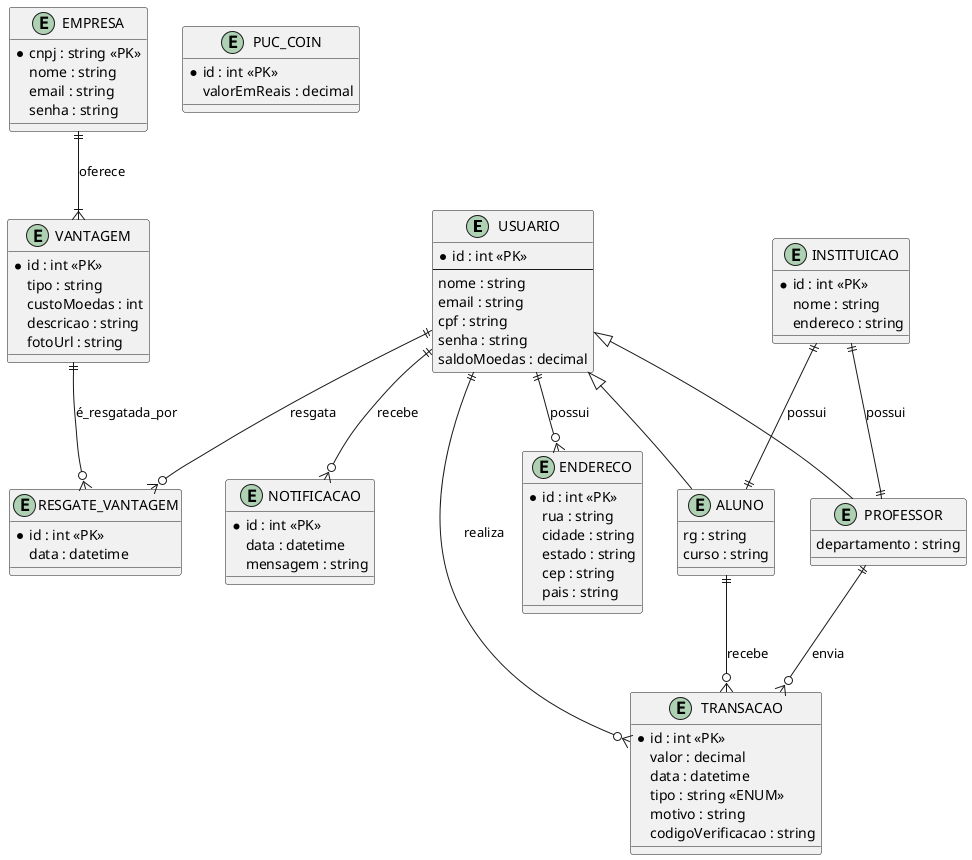

# PUCPay – Diagrama ER

```plantuml
@startuml
' Entities
entity USUARIO {
  *id : int <<PK>>
  --
  nome : string
  email : string
  cpf : string
  senha : string
  saldoMoedas : decimal
}
entity ALUNO {
  rg : string
  curso : string
}
entity PROFESSOR {
  departamento : string
}
entity INSTITUICAO {
  *id : int <<PK>>
  nome : string
  endereco : string
}
entity ENDERECO {
  *id : int <<PK>>
  rua : string
  cidade : string
  estado : string
  cep : string
  pais : string
}
entity NOTIFICACAO {
  *id : int <<PK>>
  data : datetime
  mensagem : string
}
entity EMPRESA {
  *cnpj : string <<PK>>
  nome : string
  email : string
  senha : string
}
entity VANTAGEM {
  *id : int <<PK>>
  tipo : string
  custoMoedas : int
  descricao : string
  fotoUrl : string
}
entity RESGATE_VANTAGEM {
  *id : int <<PK>>
  data : datetime
}
entity TRANSACAO {
  *id : int <<PK>>
  valor : decimal
  data : datetime
  tipo : string <<ENUM>>
  motivo : string
  codigoVerificacao : string
}
entity PUC_COIN {
  *id : int <<PK>>
  valorEmReais : decimal
}

' Inheritance
USUARIO <|-- ALUNO
USUARIO <|-- PROFESSOR

' Relationships
USUARIO ||--o{ ENDERECO : possui
USUARIO ||--o{ NOTIFICACAO : recebe
USUARIO ||--o{ TRANSACAO : realiza
USUARIO ||--o{ RESGATE_VANTAGEM : resgata
EMPRESA ||--|{ VANTAGEM : oferece
VANTAGEM ||--o{ RESGATE_VANTAGEM : é_resgatada_por
PROFESSOR ||--o{ TRANSACAO : envia
ALUNO ||--o{ TRANSACAO : recebe
INSTITUICAO ||--|| PROFESSOR : possui
INSTITUICAO ||--|| ALUNO : possui
@enduml
```

---

**Legenda**
- `PK` – Primary Key
- `FK` – Foreign Key (implícita nas ligações)
- `enum` – Tipo de transação (`ENVIO` ou `RESGATE`)
